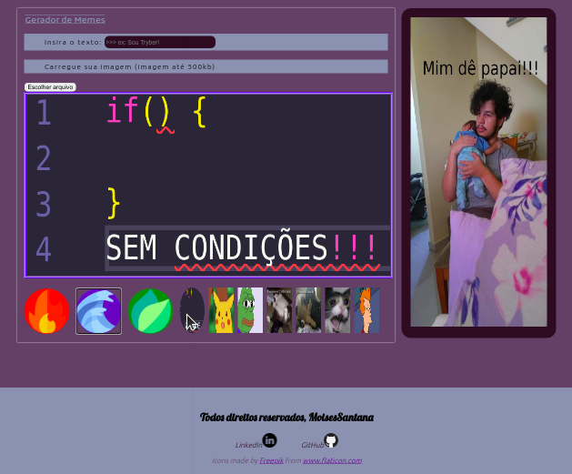

# Projeto Meme Generator

Meme Generator é um projeto idealizado pela Trybe onde temos como tarefa criar uma página web usando HTML5/CSS3/JavaScript, a página tem como objetivo permitir que o cliente carregue uma imagem de seu computador e digite um texto sobre a imagem, é disponibilizado 3 tipos de bordas para a imagem e alguns memes já prontos.

## Técnologias utilizadas:

* HTML5
* CSS3
* JavaScript

### Para visualizar basta abrir o link:

https://moisessantana.github.io/meme-generator/
